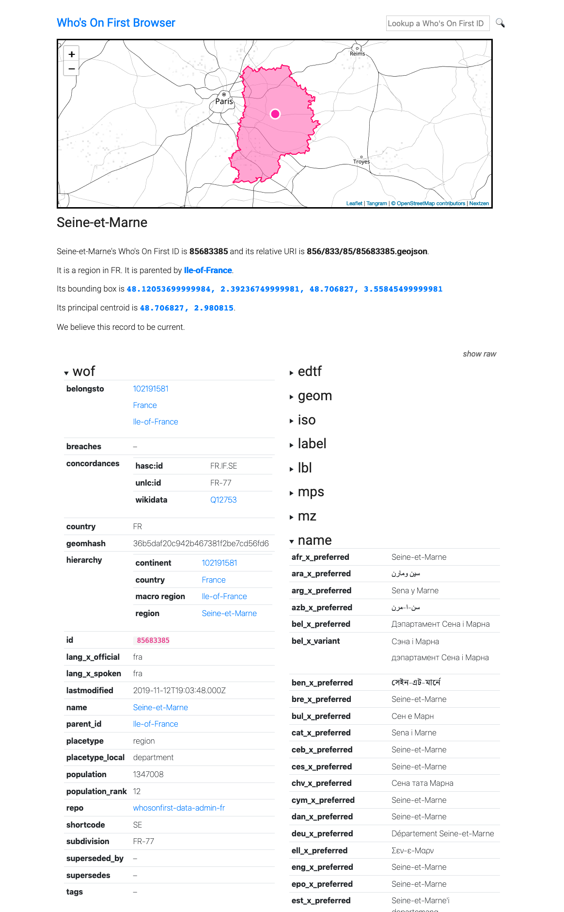

# go-whosonfirst-browser-sqlite

SQLite support for the Who's On First browser.

## Important

Work in progress. Documentation to follow but in the meantime you should consult the documentation for [go-whosonfirst-browser](https://github.com/whosonfirst/go-whosonfirst-browser).

## Example

```
$> go run cmd/whosonfirst-browser/main.go -enable-all \
	-reader-source 'sql://sqlite3/geojson/id/body?dsn=/usr/local/data/fr.db' \
	-nextzen-api-key {NEXTZEN_APIKEY}

2019/12/19 13:19:59 Listening on http://localhost:8080
```



```
http://localhost:8080/id/85683385
```

## See also

* https://github.com/whosonfirst/go-whosonfirst-browser
* https://github.com/whosonfirst/go-reader-database-sql
* https://github.com/whosonfirst/go-whosonfirst-sqlite-features