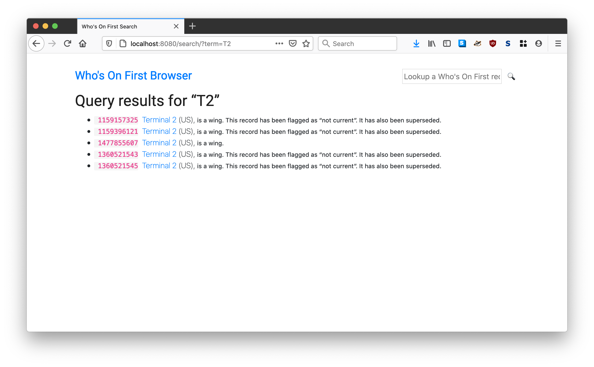
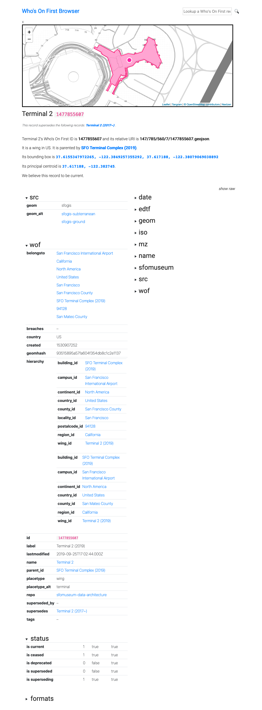

# go-whosonfirst-browser-sqlite

A Go package that implements a SQLite-enabled instance of the `whosonfirst/go-whosonfirst-browser` tool.

## Important

This package has been replaced by the [go-whosonfirst-spelunker](https://github.com/whosonfirst?q=go-whosonfirst-spelunker&type=all&language=&sort=) packages and will no longer be actively maintained.

## Description

The `go-whosonfirst-browser-sqlite` package implements a SQLite-enabled instance of the [go-whosonfirst-browser](https://github.com/whosonfirst/go-whosonfirst-browser) tool.

This package does not expose any new functionality not already provided by the `whosonfirst/go-whosonfirst-browser` package. Instead it imports the necessary packages to support loading data from a SQLite database and then launches the default `whosonfirst-browser` application.

### Important

This is work in progress. Although there is a detail example of how to use this package below complete documentation remains incomplete. In the meantime you should consult the documentation for [go-whosonfirst-browser](https://github.com/whosonfirst/go-whosonfirst-browser).

## Tools

To build binary versions of these tools run the `cli` Makefile target. For example:

```
$> make cli
go build -mod vendor -o bin/whosonfirst-browser cmd/whosonfirst-browser/main.go
```

### whosonfirst-browser

```
$> ./bin/whosonfirst-browser -h
  -cache-source string
    	A valid go-cache Cache URI string. (default "gocache://")
  -enable-all
    	Enable all the available output handlers.
  -enable-data
    	Enable the 'geojson' and 'spr' and 'select' output handlers.
  -enable-geojson
    	Enable the 'geojson' output handler. (default true)
  -enable-geojson-ld
    	Enable the 'geojson-ld' output handler. (default true)
  -enable-graphics
    	Enable the 'png' and 'svg' output handlers.
  -enable-html
    	Enable the 'html' (or human-friendly) output handlers. (default true)
  -enable-png
    	Enable the 'png' output handler.
  -enable-select
    	Enable the 'select' output handler.
  -enable-spr
    	Enable the 'spr' (or "standard places response") output handler. (default true)
  -enable-svg
    	Enable the 'svg' output handler.
  -nextzen-api-key string
    	A valid Nextzen API key (https://developers.nextzen.org/).
  -nextzen-style-url string
    	A valid Tangram scene file URL. (default "/tangram/refill-style.zip")
  -nextzen-tile-url string
    	A valid Nextzen MVT tile URL. (default "https://{s}.tile.nextzen.org/tilezen/vector/v1/512/all/{z}/{x}/{y}.mvt")
  -path-geojson string
    	The path that GeoJSON requests should be served from. (default "/geojson/")
  -path-geojson-ld string
    	The path that GeoJSON-LD requests should be served from. (default "/geojson-ld/")
  -path-id string
    	The that Who's On First documents should be served from. (default "/id/")
  -path-png string
    	The path that PNG requests should be served from. (default "/png/")
  -path-select string
    	The path that 'select' requests should be served from. (default "/select/")
  -path-spr string
    	The path that SPR requests should be served from. (default "/spr/")
  -path-svg string
    	The path that SVG requests should be served from. (default "/svg/")
  -proxy-tiles
    	Proxy (and cache) Nextzen tiles.
  -proxy-tiles-cache string
    	A valid tile proxy DSN string. (default "gocache://")
  -proxy-tiles-timeout int
    	The maximum number of seconds to allow for fetching a tile from the proxy. (default 30)
  -proxy-tiles-url string
    	The URL (a relative path) for proxied tiles. (default "/tiles/")
  -reader-source string
    	A valid go-reader Reader URI string. (default "whosonfirst-data://")
  -select-pattern string
    	A valid regular expression for sanitizing select parameters. (default "properties(?:.[a-zA-Z0-9-_]+){1,}")
  -server-uri string
    	A valid aaronland/go-http-server URI. (default "http://localhost:8080")
  -static-prefix string
    	Prepend this prefix to URLs for static assets.
  -templates string
    	An optional string for local templates. This is anything that can be read by the 'templates.ParseGlob' method.
```

## Example

### Creating a SQLite database for browsing

The `go-whosonfirst-browser-sqlite` package doesn't create or index records in a SQLite database for browsing. It only _consumes_ SQLite databases and specifically SQLite databases that have indexed records using the table definitions and logic defined in the [go-whosonfirst-sqlite-features](https://github.com/whosonfirst/go-whosonfirst-sqlite-features) package.

There are three ways to create a SQLite database to be consumed by the `go-whosonfirst-browser-sqlite` package:

1. Read the documentation and use the code in the `go-whosonfirst-sqlite-features` package and produce a SQLite database manually.
2. Use the command lines tools that are part of the [go-whosonfirst-sqlite-features-index](https://github.com/whosonfirst/go-whosonfirst-sqlite-features-index) package to create a SQLite database from one or more sources that can be indexed by the [go-whosonfirst-index](https://github.com/whosonfirst/go-whosonfirst-index) packages.
3> Use the command line tools that are part of the [go-whosonfirst-dist](https://github.com/whosonfirst/go-whosonfirst-dist) package to create a SQLite database from one or more Who's On First-style data repositories on GitHub.

This example demonstrates option #3. It uses the `wof-dist-build` tool (part of the `go-whosonfirst-dist` package) to create a single "combined" SQLite database from data in (8) different repositories in [sfomuseum-data](https://github.com/sfomuseum-data) GitHub organization. The tool is also configured to index "alternate" geometries as well as any relations defined in a record's hierarchy. By default the `wof-dist-build` tool indexes only "common" tables but because the `-build-sqlite-all` flag is set it will index the search and rtree (used for spatial indexing) related tables as well. 

Here's what that looks like:

```
$> bin/wof-dist-build \
	-combined \
	-combined-name sfomuseum-data-2020 \
	-git-organization sfomuseum-data \
	-workdir /usr/local/data/dist \
	-build-sqlite-all \
	-index-alt-files \
	-index-relations \
	-index-relations-reader-uri https://static.sfomuseum.org/data \
	-compress-all=false \
	-timings \
	-verbose \	
	sfomuseum-data-whosonfirst \
	sfomuseum-data-publicart \
	sfomuseum-data-architecture \
	sfomuseum-data-maps \
	sfomuseum-data-exhibition \
	sfomuseum-data-enterprise \
	sfomuseum-data-aircraft \
	sfomuseum-data-collection

...time passes

17:11:07.335325 [wof-dist-build] STATUS local sqlite is /usr/local/data/dist/sfomuseum-data-2020-latest.db
17:11:15.144435 [wof-dist-build] STATUS time to build UNCOMPRESSED distributions for sfomuseum-data-2020 29m44.95956821s
17:11:15.144478 [wof-dist-build] STATUS time to remove uncompressed files for sfomuseum-data-2020 1.1µs
17:11:15.144485 [wof-dist-build] STATUS time to build COMPRESSED distributions for sfomuseum-data-2020 29m44.959632175s
17:11:15.144588 [wof-dist-build] STATUS time to build distributions for 7 repos 29m44.959831649s
17:11:15.144605 [wof-dist-build] STATUS ITEMS map[sfomuseum-data-2020:[]]
17:11:15.144913 [wof-dist-build] STATUS Wrote inventory /usr/local/data/dist/sfomuseum-data-2020-inventory.json
```

A couple things to note:

* By default the `wof-dist-build` tool compresses the products it creates but because the `-compress-all=false` flag is set we can use our SQLite database as soon as it's finished being indexed.

* The `wof-dist-build` is still configured to always write a `-inventory.json` file even if there aren't any compressed distributions. This will be fixed in future releases. Until then, the `-inventory.json` file can be assumed to be safe to delete.

### Loading a SQLite database for browsing

Here's how to load the SQLite database created, in the example above, for browsing:

```
$> bin/whosonfirst-browser \
	-enable-all \
	-nextzen-api-key {NEXTZEN_APIKEY} \
	-reader-source 'sql://sqlite3/geojson/id/body?dsn=/usr/local/data/dist/sfomuseum-data-2020-latest.db' \
	-search-database-uri 'sqlite://?dsn=/usr/local/data/dist/sfomuseum-data-2020-latest.db'
```

The if you visit `http://localhost:8080/search/?term=T2` in a web browser you should see this:



If you click on the third link or visit `http://localhost:8080/id/1477855607` you'll see this:



## See also

* https://github.com/whosonfirst/go-whosonfirst-browser
* https://github.com/whosonfirst/go-reader-database-sql
* https://github.com/whosonfirst/go-whosonfirst-sqlite-features
* https://github.com/whosonfirst/go-whosonfirst-sqlite-features-index
* https://github.com/whosonfirst/go-whosonfirst-dist
